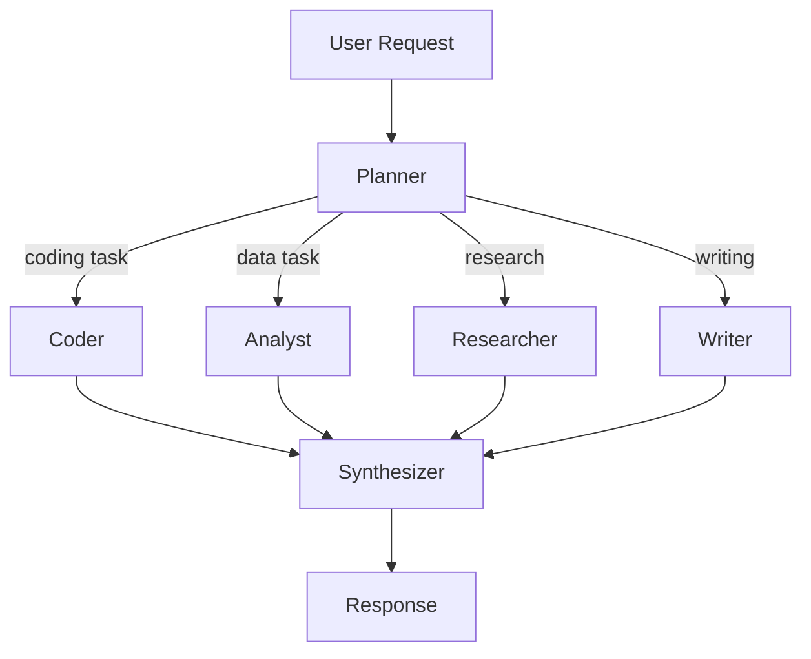

# Oracle Configuration Specification
## Version 5.0 - Personal Assistant Edition

---

## Overview

Oracle 5.0 introduces a comprehensive configuration system supporting both:
1. **Structured Configuration** (`oraclesettings.json`) - Machine-readable, programmatic access
2. **Markdown Configuration** (`AGENTS.md`, `SOUL.md`, `TOOLS.md`) - Human-readable, Git-friendly

---

## File Locations

```
~/.oracle/                          # Main configuration directory
├── oraclesettings.json             # Primary configuration file
├── AGENTS.md                       # Agent crew definitions
├── SOUL.md                         # Personality & behavior
├── TOOLS.md                        # Tool conventions
├── MEMORY.md                       # Long-term memory
├── HEARTBEAT.md                    # Scheduled tasks
├── credentials/                    # API keys & secrets
│   ├── gemini.json
│   ├── anthropic.json
│   └── openai.json
├── workspace/                      # Active working directory
└── cache/                          # Temporary files
```

---

## 1. oraclesettings.json

### Complete Schema

```json
{
  "$schema": "https://oracle.ai/schemas/settings-v5.json",
  "version": "5.0.0",
  
  "oracle": {
    "name": "My Assistant",
    "mode": "personal",
    "auto_start": true,
    "workspace_path": "~/.oracle/workspace"
  },
  
  "llm": {
    "primary": {
      "provider": "anthropic",
      "model": "claude-3-5-sonnet-20241022",
      "api_key": "${ANTHROPIC_API_KEY}",
      "temperature": 0.7,
      "max_tokens": 4096,
      "thinking": {
        "enabled": true,
        "budget_tokens": 2000
      }
    },
    "fallbacks": [
      {
        "provider": "gemini",
        "model": "gemini-2.0-flash-exp",
        "api_key": "${GEMINI_API_KEY}"
      },
      {
        "provider": "ollama",
        "model": "llama3.2:70b",
        "base_url": "http://localhost:11434"
      }
    ],
    "routing_strategy": "failover",
    "cost_optimization": {
      "enabled": true,
      "heartbeat_model": "gemini-2.0-flash-lite",
      "simple_tasks": "gemini-2.0-flash",
      "complex_tasks": "claude-3-5-sonnet"
    }
  },
  
  "messaging": {
    "gateway": {
      "enabled": true,
      "port": 18789,
      "host": "127.0.0.1",
      "auth": {
        "type": "token",
        "token": "${GATEWAY_AUTH_TOKEN}"
      }
    },
    "channels": {
      "whatsapp": {
        "enabled": true,
        "session_name": "oracle_main",
        "qr_timeout": 60000,
        "webhook_url": null
      },
      "telegram": {
        "enabled": true,
        "bot_token": "${TELEGRAM_BOT_TOKEN}",
        "allowed_usernames": ["@myusername"]
      },
      "slack": {
        "enabled": false,
        "app_token": "${SLACK_APP_TOKEN}",
        "bot_token": "${SLACK_BOT_TOKEN}",
        "socket_mode": true
      },
      "discord": {
        "enabled": false,
        "bot_token": "${DISCORD_BOT_TOKEN}"
      },
      "email": {
        "enabled": true,
        "imap": {
          "host": "imap.gmail.com",
          "port": 993,
          "username": "${EMAIL_USER}",
          "password": "${EMAIL_PASSWORD}"
        },
        "smtp": {
          "host": "smtp.gmail.com",
          "port": 587,
          "username": "${EMAIL_USER}",
          "password": "${EMAIL_PASSWORD}"
        },
        "check_interval": 300
      }
    }
  },
  
  "crew": {
    "default_crew": "personal_assistant",
    "crews_path": "~/.oracle/agents",
    "max_parallel_agents": 3,
    "require_approval_for": [
      "shell_execute",
      "file_delete",
      "email_send",
      "money_transfer"
    ]
  },
  
  "persistence": {
    "backend": "markdown",
    "sql": {
      "url": "sqlite:///~/.oracle/oracle.db",
      "wal_mode": true
    },
    "markdown": {
      "path": "~/.oracle",
      "auto_commit": true,
      "git_integration": true
    },
    "sync": {
      "enabled": false,
      "provider": "gcs",
      "bucket": "${GCS_BUCKET}",
      "interval": 3600
    }
  },
  
  "skills": {
    "path": "~/.oracle/skills",
    "auto_update": true,
    "trusted_sources": [
      "https://hub.oracle.ai",
      "https://clawhub.openclaw.ai"
    ],
    "sandbox": {
      "default_mode": "strict",
      "allowed_hosts": ["*.googleapis.com", "*.anthropic.com"],
      "blocked_commands": ["rm -rf /", "sudo", "chmod 777"]
    }
  },
  
  "mcp": {
    "enabled": true,
    "servers": {
      "filesystem": {
        "command": "npx",
        "args": ["-y", "@modelcontextprotocol/server-filesystem", "~/.oracle/workspace"]
      },
      "github": {
        "command": "npx",
        "args": ["-y", "@modelcontextprotocol/server-github"],
        "env": {
          "GITHUB_PERSONAL_ACCESS_TOKEN": "${GITHUB_TOKEN}"
        }
      }
    }
  },
  
  "a2a": {
    "enabled": true,
    "agent_card": {
      "name": "My Oracle Assistant",
      "description": "Personal AI assistant with multi-agent capabilities",
      "version": "5.0.0",
      "capabilities": {
        "streaming": true,
        "pushNotifications": true
      }
    },
    "port": 10000,
    "discoverable": false
  },
  
  "security": {
    "mode": "sandboxed",
    "elevation": {
      "require_confirmation": true,
      "timeout_seconds": 300,
      "persistent_elevation": false
    },
    "audit": {
      "enabled": true,
      "log_path": "~/.oracle/logs/audit.log",
      "retention_days": 90
    },
    "network": {
      "outbound": "whitelist",
      "allowed_hosts": [],
      "blocked_hosts": []
    }
  },
  
  "multimodal": {
    "enabled": true,
    "image": {
      "max_size": 4096,
      "supported_formats": ["png", "jpg", "webp", "gif"]
    },
    "video": {
      "enabled": true,
      "max_duration": 300,
      "extract_frames": 10
    },
    "audio": {
      "enabled": true,
      "transcribe": true,
      "supported_formats": ["mp3", "wav", "ogg", "m4a"]
    }
  },
  
  "heartbeat": {
    "enabled": true,
    "interval_minutes": 30,
    "checklist_path": "~/.oracle/HEARTBEAT.md",
    "quiet_hours": {
      "start": "23:00",
      "end": "08:00"
    },
    "cost_optimization": {
      "use_cheap_model": true,
      "skip_if_inactive": true
    }
  },
  
  "dev_ui": {
    "enabled": true,
    "port": 8080,
    "host": "127.0.0.1",
    "auth": {
      "enabled": true,
      "type": "password",
      "password_hash": null
    },
    "features": {
      "workflow_designer": true,
      "debug_panel": true,
      "cost_tracking": true,
      "token_visualization": true
    }
  },
  
  "logging": {
    "level": "INFO",
    "format": "structured",
    "output": {
      "console": true,
      "file": "~/.oracle/logs/oracle.log"
    }
  }
}
```

---

## 2. Markdown Configuration Files

### AGENTS.md - Agent Crew Definition

```markdown
---
crew_version: "1.0"
default: true
---

# My Personal Assistant Crew

This crew handles my day-to-day tasks with specialized agents.

## Agents

### Planner
**Model:** claude-3-5-sonnet  
**Role:** Analyzes requests and creates execution plans  
**Delegates to:** coder, analyst, researcher, writer  

You are a planning specialist. When given a task:
1. Break it down into specific subtasks
2. Assign each subtask to the most appropriate agent
3. Consider dependencies between tasks
4. Return a clear execution plan

### Coder
**Model:** claude-3-5-sonnet  
**Role:** Writes, debugs, and reviews code  
**Tools:** shell_execute, file_system_ops, code_interpreter, github  

You are a senior software engineer. You:
- Write clean, well-documented code
- Follow best practices for the language/framework
- Test your solutions before marking complete
- Explain your approach clearly

### Analyst  
**Model:** gemini-2.0-flash  
**Role:** Data analysis and visualization  
**Tools:** file_system_ops, data_analysis, chart_generation  

You are a data analyst. You:
- Extract insights from datasets
- Create clear visualizations
- Explain findings in business terms
- Suggest actionable recommendations

### Researcher
**Model:** perplexity-online  
**Role:** Web research and information gathering  
**Tools:** web_search, http_fetch, news_api  

You are a research specialist. You:
- Find accurate, up-to-date information
- Use authoritative sources
- Cite your sources clearly
- Summarize complex topics

### Writer
**Model:** claude-3-5-sonnet  
**Role:** Content creation and editing  
**Tools:** file_system_ops  

You are a professional writer. You:
- Adapt tone to the audience
- Structure content for clarity
- Edit for grammar and style
- Follow brand guidelines

## Workflow

**Type:** Hierarchical  
**Planner delegates:** true  
**Max parallel:** 3  
**Require approval:** shell_execute, file_delete, email_send



## Memory

- User prefers concise responses
- User is a software engineer
- User works in Pacific Time
- User prefers Python for scripting
```

---

### SOUL.md - Personality & Behavior

```markdown
---
version: "1.0"
personality_version: "2026-03"
---

# Oracle's Personality

## Core Identity

I am Oracle, a helpful AI assistant focused on getting things done. I balance professionalism with warmth, and efficiency with thoroughness.

## Communication Style

### Tone
- **Default:** Professional but friendly
- **Casual contexts:** Can be more relaxed and use humor
- **Urgent matters:** Direct and concise
- **Complex explanations:** Patient and step-by-step

### Language Preferences
- Use clear, simple language when possible
- Avoid jargon unless speaking with technical users
- Explain acronyms on first use
- Match the user's communication style

### Response Structure
1. Direct answer first
2. Supporting details if relevant
3. Next steps or suggestions
4. Offer for clarification

## Behavioral Guidelines

### Proactivity
- Suggest helpful next steps
- Anticipate follow-up questions
- Offer alternatives when appropriate
- Respect user's time - be concise

### Learning Preferences
- Remember user corrections
- Adapt to feedback
- Ask clarifying questions when uncertain
- Build on previous conversations

### Boundaries
- Acknowledge limitations honestly
- Decline harmful requests
- Respect privacy and security
- Don't pretend to know what I don't

## Relationship Memory

### User Preferences
- Response style: concise
- Technical level: expert (software)
- Preferred languages: Python, TypeScript
- Timezone: America/Los_Angeles
- Working hours: 09:00-18:00 PT

### Important Context
- User works at [Company] as [Role]
- Current projects: [Project A], [Project B]
- Preferred tools: VS Code, Docker, GitHub
- Learning goals: Machine learning, Rust

### Communication History
- 2026-03-10: User prefers bullet points for lists
- 2026-03-12: User corrected my use of "simple" - prefers "straightforward"
- 2026-03-14: User appreciates proactive suggestions
```

---

### TOOLS.md - Tool Conventions

```markdown
---
version: "1.0"
convention_version: "2026-03"
---

# Tool Usage Conventions

## Shell Execution

### Safe Commands (Auto-approve)
- `ls`, `pwd`, `cat`, `grep`, `find`
- `git status`, `git log`, `git diff`
- `docker ps`, `docker images`
- `python --version`, `node --version`

### Require Confirmation
- `rm` (any form)
- `sudo` (any command)
- `chmod`, `chown`
- `git push`, `git reset --hard`
- `docker system prune`
- `kill`, `pkill`

### Blocked Commands
- `rm -rf /`
- `sudo rm -rf`
- `mkfs`, `dd`
- `curl | bash` (pipe to shell)

## File Operations

### Workspace Structure
- Active projects: `~/workspace/current/`
- Archive: `~/workspace/archive/`
- Scratch: `~/workspace/scratch/`
- Downloads: `~/workspace/downloads/`

### Naming Conventions
- Use kebab-case for files: `my-file.txt`
- Include dates for archives: `backup-2026-03-15.zip`
- Use descriptive names: `customer-analysis-q1.py`

## Git Workflow

### Commit Message Format
```
type(scope): subject

body

footer
```

Types: feat, fix, docs, style, refactor, test, chore

### Before Committing
1. Run tests
2. Check git status
3. Review diff
4. Write meaningful message

## Code Style

### Python
- Follow PEP 8
- Use type hints
- Document with docstrings
- Maximum line length: 100

### JavaScript/TypeScript
- Use ESLint configuration
- Prefer async/await
- Use strict TypeScript
- Maximum line length: 100
```

---

### MEMORY.md - Long-term Memory

```markdown
---
version: "1.0"
last_updated: "2026-03-15T10:30:00Z"
---

# Long-term Memory

## Facts

### Technical Skills
- [2026-03-01] User is proficient in Python, TypeScript, Go
- [2026-03-05] User is learning Rust, currently at beginner level
- [2026-03-10] User prefers functional programming patterns

### Preferences
- [2026-03-02] Prefers concise responses over verbose explanations
- [2026-03-08] Likes dark mode in all applications
- [2026-03-12] Prefers bullet points for lists over paragraphs
- [2026-03-14] Appreciates proactive suggestions

### Relationships
- [2026-03-03] Works with Sarah (project manager) - prefers Slack
- [2026-03-06] Reports to Mike (CTO) - monthly 1:1s
- [2026-03-09] Mentors junior developers Tom and Lisa

### Projects
- [2026-03-04] **Project Alpha:** Microservices migration (Q2 goal)
- [2026-03-07] **Project Beta:** ML pipeline for recommendations
- [2026-03-11] **Side Project:** Open source CLI tool

## Learnings

### Corrections Applied
- [2026-03-10] Stop using "simple" - use "straightforward" instead
- [2026-03-13] User prefers specific times ("3pm") over relative ("in 2 hours")

### Successful Patterns
- [2026-03-14] User responds well to structured options (A/B/C)
- [2026-03-15] Morning briefings should include calendar + GitHub + news

## Scheduled Reminders

- [2026-03-20] Check in on Project Alpha timeline
- [2026-04-01] Quarterly goals review
```

---

### HEARTBEAT.md - Scheduled Tasks

```markdown
---
version: "1.0"
interval_minutes: 30
last_run: "2026-03-15T11:00:00Z"
---

# Heartbeat Checklist

Tasks to check on each heartbeat interval.

## Morning Briefing (09:00)

- [ ] Check calendar for today's meetings
- [ ] Review GitHub notifications (priority: mentions, reviews)
- [ ] Check email for urgent items
- [ ] Summarize in brief message to user

Condition: Only if user hasn't been active in last 2 hours

## Email Monitoring

- [ ] Check inbox for urgent emails (from VIP list)
- [ ] Flag emails requiring response > 24 hours
- [ ] Summarize newsletters (weekly digest only)

## GitHub Monitoring

- [ ] Check assigned PRs
- [ ] Check failing CI/CD on user's repos
- [ ] Check security alerts

## Daily Summary (18:00)

- [ ] Summarize completed tasks
- [ ] Highlight pending items for tomorrow
- [ ] Report any blocked items

Condition: Only on weekdays

## Weekly Tasks (Monday 08:00)

- [ ] Generate week-ahead calendar preview
- [ ] Review sprint goals
- [ ] Check quarterly OKR progress

## Ad-hoc Monitoring

- [ ] Monitor @mentions on Slack (priority: DM, @here, @channel)
- [ ] Monitor SMS for urgent keywords: "urgent", "asap", "emergency"

## Escalation Rules

1. **Immediate:** SMS for critical production issues
2. **Within 1 hour:** Slack for failing CI/CD on main branch
3. **Daily digest:** Non-urgent emails, routine GitHub notifications
4. **Weekly:** Newsletters, blog updates
```

---

## 3. Environment Variables

### Required

| Variable | Description | Used In |
|----------|-------------|---------|
| `ORACLE_WORKSPACE` | Path to workspace directory | All components |

### LLM Providers (at least one)

| Variable | Provider | Get From |
|----------|----------|----------|
| `ANTHROPIC_API_KEY` | Claude | console.anthropic.com |
| `OPENAI_API_KEY` | GPT | platform.openai.com |
| `GEMINI_API_KEY` | Gemini | aistudio.google.com |
| `DEEPSEEK_API_KEY` | DeepSeek | platform.deepseek.com |

### Messaging (optional)

| Variable | Platform | Get From |
|----------|----------|----------|
| `TELEGRAM_BOT_TOKEN` | Telegram | @BotFather |
| `SLACK_APP_TOKEN` | Slack | api.slack.com |
| `SLACK_BOT_TOKEN` | Slack | api.slack.com |
| `DISCORD_BOT_TOKEN` | Discord | discord.com/developers |
| `EMAIL_USER` | Email | Your provider |
| `EMAIL_PASSWORD` | Email | App-specific password |

### Cloud (optional)

| Variable | Service | Used For |
|----------|---------|----------|
| `GCS_BUCKET` | Google Cloud | Backup, sync |
| `GCP_PROJECT_ID` | Google Cloud | Vertex AI |

---

## 4. Validation Schema

```python
# Configuration validation using Pydantic

from pydantic import BaseModel, Field, validator
from typing import Literal

class LLMConfig(BaseModel):
    provider: Literal["anthropic", "openai", "gemini", "ollama", "deepseek"]
    model: str
    api_key: str | None = Field(None, regex=r"^sk-[a-zA-Z0-9]+")
    temperature: float = Field(0.7, ge=0, le=2)
    max_tokens: int = Field(4096, ge=1, le=100000)

class SecurityConfig(BaseModel):
    mode: Literal["sandboxed", "docker", "full"]
    
    @validator('mode')
    def validate_full_mode(cls, v, values):
        if v == "full":
            # Require explicit acknowledgment
            if not os.getenv("ORACLE_ENABLE_FULL_ACCESS"):
                raise ValueError(
                    "Full access mode requires ORACLE_ENABLE_FULL_ACCESS=1"
                )
        return v

class OracleSettings(BaseModel):
    version: str = "5.0.0"
    llm: dict[str, LLMConfig]
    security: SecurityConfig
    messaging: MessagingConfig
    # ... etc
```

---

## 5. Migration from Oracle 4.0

### Automatic Migration

```bash
# Run migration tool
oracle migrate --from 4.0 --to 5.0

# This will:
# 1. Convert existing SQLite sessions to Markdown
# 2. Create default AGENTS.md, SOUL.md, TOOLS.md
# 3. Update oraclesettings.json with new schema
# 4. Backup old configuration
```

### Manual Steps

1. **Backup existing data:**
   ```bash
   cp -r ~/.oracle ~/.oracle-backup-4.0
   ```

2. **Create new configuration:**
   ```bash
   oracle init --interactive
   ```

3. **Migrate sessions (optional):**
   ```bash
   oracle sessions export --format markdown
   ```

4. **Verify setup:**
   ```bash
   oracle doctor
   ```

---

## 6. Best Practices

### Version Control

```bash
# Initialize git in oracle directory
cd ~/.oracle
git init
git add AGENTS.md SOUL.md TOOLS.md MEMORY.md HEARTBEAT.md
git commit -m "Initial oracle configuration"

# Ignore sensitive files
echo "credentials/" >> .gitignore
echo "oraclesettings.json" >> .gitignore
git add .gitignore
git commit -m "Add gitignore"
```

### Team Sharing

```bash
# Share crew configuration
git clone https://github.com/team/oracle-crews
cp oracle-crews/data-team.yaml ~/.oracle/agents/

# Use team crew
oracle crew use data-team
```

### Backup Strategy

```json
{
  "persistence": {
    "sync": {
      "enabled": true,
      "provider": "gcs",
      "bucket": "my-oracle-backup",
      "interval": 3600,
      "encrypt": true
    }
  }
}
```

---

*Last updated: 2026-03-15*  
*Specification version: 5.0.0*
